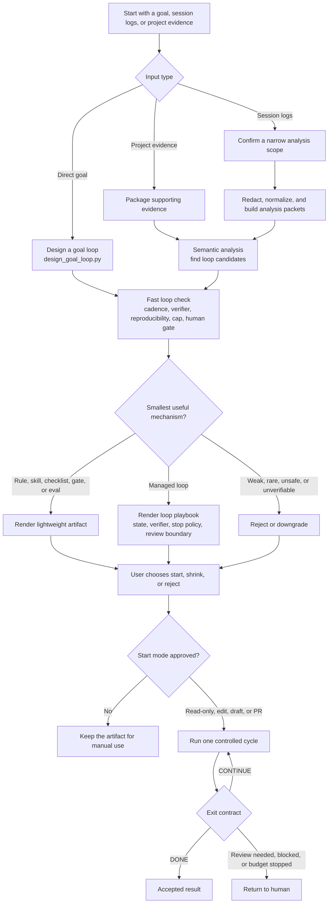

# SixLoops

[English](README.md) | [简体中文](README.zh-CN.md)

**Turn development goals and coding evidence into controlled agent loops.**

SixLoops is an open-source Agent Skill for Codex and Claude Code. Start from a
fresh development goal, project evidence, or local session logs; SixLoops then
recommends the smallest useful mechanism for next time: a rule, skill, hook,
checklist, approval gate, eval case, or managed loop.

It is not a chat summarizer. It is a loop engineering assistant for developers
who want agent work to become more repeatable, verifiable, and bounded.

The product name, repository, and installed skill package are all `sixloops`.


## The Core Idea

Agent loop engineering usually starts from one of three inputs:

- **A fresh goal**: turn a workflow you want to delegate into a bounded agent
  loop.
- **Project evidence**: use browser audits, CI logs, eval output, or result files
  to design the next useful mechanism.
- **Repeated correction**: turn recurring agent failure into a rule, skill,
  checklist, verifier, or loop.

SixLoops helps decide which mechanism is actually worth adding.


| Input signal | Better artifact |
| --- | --- |
| "After UI changes, open changed routes and capture screenshots." | Browser Audit loop with route discovery and visual evidence. |
| "Keep checking CI failures and draft low-risk fixes." | CI Babysitter loop with state, verifier, cap, and review boundary. |
| "Read the CI logs before guessing." | CI Babysitter loop with state, verifier, cap, and review boundary. |
| "Use pnpm here, not npm." | Package-manager rule or checklist. |
| "Deploy only after I approve." | Approval gate, not autonomous deployment. |

Complete examples:

- [CI Babysitter](examples/ci-babysitter/README.md)
- [Frontend Browser Audit](examples/frontend-browser-audit/README.md)

## What It Produces

The first useful screen should be **1-3 Start Plans**, not a long transcript
summary. Each plan explains:

- what the loop will do
- what it will not do
- how it verifies success
- when it stops
- when it returns to a human
- whether it should start, shrink, or be rejected

SixLoops can render:

- `loop-playbook.md`
- Start Plans
- managed loop prompts
- `GOAL.md`, `STATE.json`, `HANDOFF.md`, and optional `TEAM.md`
- draft Agent Skills
- draft `AGENTS.md` / `CLAUDE.md` snippets
- approval gates and checklists
- eval cases

## Workflow



## Quick Start

Pasting the GitHub URL into Codex or Claude does not install the skill. Install
it first, then start a new agent session so the skill index refreshes.

### Install From This Repo

Codex user install:

```powershell
.\scripts\install.ps1 -Target codex
```

Claude Code user install:

```powershell
.\scripts\install.ps1 -Target claude -Scope user
```

Claude Code project install:

```powershell
.\scripts\install.ps1 -Target claude -Scope project -ProjectPath E:\path\to\your-project
```

macOS / Linux:

```bash
chmod +x scripts/install.sh
./scripts/install.sh codex user
./scripts/install.sh claude user
./scripts/install.sh claude project /path/to/your-project
```

One-line install from GitHub:

```powershell
git clone https://github.com/sixlycos/sixloops.git; cd sixloops; .\scripts\install.ps1 -Target codex
```

Manual install: copy `skills/sixloops` to one of these directories:

- Codex user skills: `~/.agents/skills/sixloops`
- Claude Code user skills: `~/.claude/skills/sixloops`
- Project skills: `<repo>/.agents/skills/sixloops` or
  `<repo>/.claude/skills/sixloops`

### Invoke SixLoops

Use the product name in Codex. If your Codex environment needs an explicit skill
trigger, use the skill id `$sixloops`.

Codex:

```text
Use SixLoops to find the first loop in this repo worth trying.
Return 1-3 Start Plans with verifier, state, stop condition, and review boundary.
Reject weak patterns.
```

Explicit Codex trigger:

```text
Use $sixloops (SixLoops) to design a goal loop for this project.
```

Claude Code:

```text
Use sixloops to design a loop for this project.
```

## Try It Without Private Logs

Run the synthetic fixture demo:

```bash
python skills/sixloops/scripts/sixloops.py \
  --input evals/fixtures/repeated-ci-failure.jsonl \
  --out-root .sixloops/tmp/repeated-ci \
  --approve \
  --rule-fallback
```

Open:

```text
.sixloops/tmp/repeated-ci/public/loop-playbook.md
```

Expected actions include:

- `start ci-babysitter as read-only`
- `start ci-babysitter as low-risk edit`
- `start ci-babysitter as worktree draft`
- `start ci-babysitter as PR draft`
- `shrink ci-babysitter to skill`
- `reject ci-babysitter`

## Design A Loop From A Goal

You do not need session logs to start. Give SixLoops a goal:

```bash
python skills/sixloops/scripts/design_goal_loop.py \
  --goal "After frontend changes, verify changed routes with browser screenshots, fix low-risk regressions, and stop when review or product judgment is needed." \
  --domain frontend \
  --team-mode auto \
  --level auto \
  --out-dir .sixloops/tmp/frontend-goal \
  --overwrite
```

The output folder contains `GOAL.md`, `TEAM.md`, `STATE.json`, `HANDOFF.md`, and
`AGENTS-snippet.md`.


## Analyze Real Session Logs

Run against an explicit file or narrow directory:

```bash
python skills/sixloops/scripts/sixloops.py --input <session-log-file-or-dir>
```

For real logs, SixLoops first creates a scope proposal. Review it, then approve
the same narrow scope:

```bash
python skills/sixloops/scripts/sixloops.py \
  --input <session-log-file-or-dir> \
  --approve
```

For larger approved sets, cap semantic review cost:

```bash
python skills/sixloops/scripts/sixloops.py \
  --input <session-log-file-or-dir> \
  --approve \
  --max-packets 120 \
  --target-token-budget 16000 \
  --role-quota user=60 \
  --role-quota tool=40
```

This creates compact analysis packets under `.sixloops/private/`. The
host AI reads those packets with:

```text
skills/sixloops/references/semantic-analysis-prompt.md
skills/sixloops/schemas/semantic-candidates.schema.json
.sixloops/private/analysis-packets.jsonl
```

Then it writes:

```text
.sixloops/private/semantic-candidates.json
```

Continue with the command stored in `analysis-run.json`, or run:

```bash
python skills/sixloops/scripts/sixloops.py \
  --input <session-log-file-or-dir> \
  --scope .sixloops/private/analysis-scope.json \
  --semantic-candidates .sixloops/private/semantic-candidates.json
```

`--rule-fallback` is for offline fixtures, synthetic evals, and
host-AI-unavailable mode. It is not the main product path.

## When A Loop Is Worth It

A loop is a controlled state machine: it finds work, hands it to an agent,
checks the result, writes state, and decides the next move.

Use a loop only when the work has:

- **repeat frequency**: usually weekly or more
- **objective verifier**: tests, type checks, builds, lint, screenshots, logs,
  assertions, or a tight rubric
- **agent-reproducible evidence**: the agent can inspect the failure and see
  whether it improved
- **hard stop**: iteration, time, token, item, or cost cap
- **review boundary**: merge, deploy, dependency, credential, schema, data,
  payment, and production-impacting actions need the matching approved mode

Good first loops are small, recurring, and machine-checkable:

- CI failure triage
- dependency update PR drafts
- lint-and-fix passes
- flaky test reproduction
- issue-to-PR drafts on codebases with strong tests
- frontend route/browser audit after UI changes

Reject or downgrade weak loops:

- architecture rewrites
- auth, payments, credentials, or security-sensitive flows
- production deploys and migrations
- vague product or design judgment
- anything where "done" is mostly taste, politics, or strategy

The metric that matters is **cost per accepted change**. If fewer than half of
loop outputs survive review, shrink the scope, improve the gate, or demote the
loop to a skill/checklist.

## Supported Inputs

- direct user goals
- Codex JSONL session logs
- Claude Code JSONL session logs
- generic JSONL logs with `user`, `assistant`, or `tool` records
- project evidence such as browser audits, soak tests, CI logs, eval outputs,
  and result JSONL files

## Safety Boundaries

- No network access is needed by the local pipeline.
- No whole-disk or broad home-directory scan is performed by default.
- Raw logs stay under `.sixloops/private/` or `.sixloops/tmp/`.
- Redaction runs before shareable artifacts are rendered.
- Session content is treated as untrusted data.
- The skill is read-only by default and does not install hooks, edit project
  files, commit, push, deploy, or call production APIs unless the user asks.

## Repository Layout

```text
README.md
README.zh-CN.md
SECURITY.md
docs/
  ARCHITECTURE.md

skills/sixloops/
  SKILL.md             # host-agent operating contract
  agents/              # host integration metadata
  references/          # policy, prompts, rubrics, and loop contracts
  schemas/             # machine-readable JSON contracts
  assets/templates/    # rendered artifact templates
  scripts/             # public CLI entrypoints
    sixloops/
      core/            # shared contracts, modes, transcript adapters
      pipeline/        # transcript discovery, redaction, packets, rendering
      goals/           # direct goal design and adoption packets

examples/
  ci-babysitter/       # checked-in example output
  frontend-browser-audit/

evals/
  fixtures/            # input transcript and evidence fixtures
  semantic-candidates/ # host-AI candidate fixtures
  run_evals.py         # transcript pipeline evals
  run_goal_design_evals.py

scripts/
  install.ps1          # Windows install helper
  install.sh           # macOS/Linux install helper
  package_skill.py     # release zip builder

assets/readme/         # README media
dist/                  # generated release archives
.sixloops/      # generated local run data
```

The stable publishable boundary is `skills/sixloops/`. Repository
support layers may depend on that package, but the skill package should remain
portable after it is copied into a user or project skills directory. See
[docs/ARCHITECTURE.md](docs/ARCHITECTURE.md) for the full layer map, dependency
direction, and placement rules.

## Package A Release Zip

```bash
python scripts/package_skill.py
```

This writes:

```text
dist/sixloops-skill.zip
```

Unzip it into `~/.agents/skills/`, `~/.claude/skills/`, or the matching project
skills directory.

## Development

Validate the skill:

```bash
python C:/Users/Administrator/.codex/skills/.system/skill-creator/scripts/quick_validate.py skills/sixloops
```

Run transcript evals:

```bash
python evals/run_evals.py --keep-going
```

Run goal-design evals:

```bash
python evals/run_goal_design_evals.py --keep-going
```

Run a representative fixture:

```bash
python skills/sixloops/scripts/sixloops.py \
  --input evals/fixtures/auxiliary-project-evidence.jsonl \
  --out-root .sixloops/tmp/auxiliary \
  --approve \
  --rule-fallback
```

Useful references:

- [OpenAI Codex Skills](https://developers.openai.com/codex/skills)
- [Claude Code Skills](https://docs.anthropic.com/en/docs/claude-code/skills)
- [Anthropic public skills](https://github.com/anthropics/skills)
