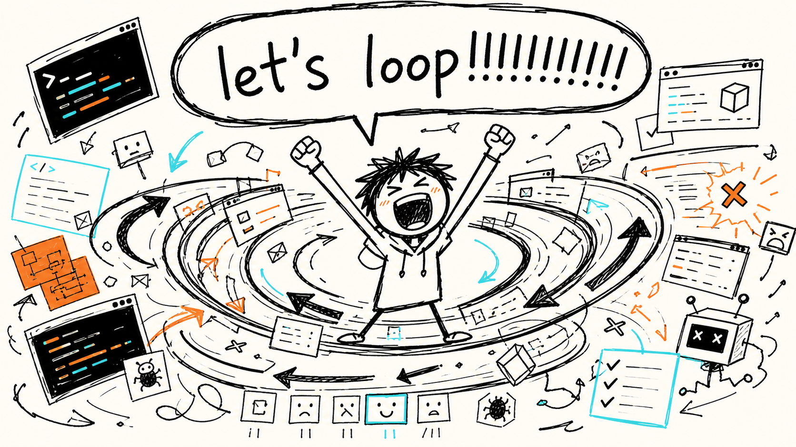
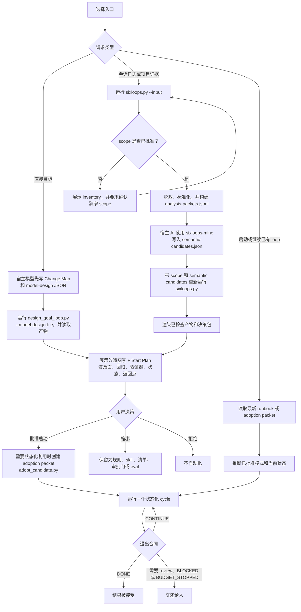

# SixLoops

[English](README.md) | [简体中文](README.zh-CN.md)

**把开发目标和编码证据，变成可状态化运行的 agent loop。**

SixLoops 是一个面向 Codex 和 Claude Code 的开源 Agent Skill 集合。你可以从一
个新的开发目标、项目证据或本地会话日志开始；SixLoops 会先把当前 X 到目标 B 的
改造图景画出来，再为下一次推荐真正有用的机制：规则、skill、hook、清单、决策包、
eval case，或者一个可托管的 loop。

它不是聊天记录总结器。它是给开发者使用的 loop engineering assistant，用来把
agent 工作变得更可重复、可验证，并且能持续往前推进。

SixLoops 是模型主导的。Codex 或 Claude Code 通过 skill prompt 完成语义抽取、
命名、判断和解释。Python pipeline 刻意保持无聊：发现狭窄输入、脱敏、打包
packets、做确定性检查，并渲染模型写出的产物。

真正的 loop 还必须自然推进。每轮结束前，SixLoops 产物会要求 agent 写入
`next_cursor`、`next_expected_evidence`、`next_verifier` 和
`human_friction_delta`：下一轮从哪里接、预期拿到什么新证据、谁能拒绝它，以及本轮
有没有减少重复人工解释。否则就不要继续，应该停止、交还或降级成更小机制。
当存在多个可行下一步时，模型应该先按价值、风险、可回退性和验收路径自主选择一个
最合适的有边界步骤，并控制必要的子角色启停；只有真正需要人类判断或更高授权时才
请求用户帮助。

产品名和仓库名是 `sixloops`；安装后是一个小 skill 集合：`sixloops`、
`sixloops-mine`、`sixloops-design`、`sixloops-adopt`。



## 核心理念

Agent loop engineering 通常从三种输入开始：

- **一个新目标**：把你想交给 agent 的工作流，设计成有边界的 loop。
- **项目证据**：用 browser audits、CI logs、eval outputs 或结果文件，设计下一
  个有用机制。
- **反复纠正**：把重复出现的 agent 失败，沉淀成规则、skill、清单、验证器或 loop。

SixLoops 帮你判断哪一种机制真的值得加入。


| 输入信号 | 更合适的产物 |
| --- | --- |
| “UI 改完后，打开变更路由并截图。” | 带路由发现和视觉证据的 Browser Audit loop。 |
| “持续检查 CI failure，并起草低风险修复。” | 带状态、验证器、上限和明确返回点的 CI Babysitter loop。 |
| “先读 CI 日志，不要猜。” | 带状态、验证器、上限和明确返回点的 CI Babysitter loop。 |
| “这里用 pnpm，不要用 npm。” | 包管理器规则或清单。 |
| “只有我批准后才能部署。” | 审批门，而不是自动部署。 |

完整示例：

- [CI Babysitter](examples/ci-babysitter/README.md)
- [Frontend Browser Audit](examples/frontend-browser-audit/README.md)

## 它会产出什么

对直接开发目标，第一个有用的界面应该是 **改造图景 + Start Plan**，而不是保守
任务清单或很长的会话总结。改造图景会说明：

- 当前 X
- 目标 B
- 用户或运营者如何感知这个变化
- 产品和技术波及面
- 回归、恢复或兼容检查
- 推进波次
- 哪些判断需要先形成决策包再交还给用户

对从会话证据挖出的机会，第一屏仍然是 **1-3 个 Start Plan**。每个计划会说明：

- 这个 loop 会做什么
- 当前模式外先不碰什么
- 如何验证成功
- 什么时候停止
- 下一轮如何自然接上，而不是重跑同一个提示
- 什么时候交还给人
- 应该启动、缩小，还是拒绝

SixLoops 可以渲染：

- `loop-playbook.md`
- Start Plans
- 可托管的 loop prompts
- `GOAL.md`、`STATE.json`、`HANDOFF.md`，以及可选的 `TEAM.md`
- draft Agent Skills
- draft `AGENTS.md` / `CLAUDE.md` 片段
- 决策包、审批门和清单
- eval cases

## 工作流程



## 快速开始

把 GitHub URL 粘到 Codex 或 Claude 里并不会安装 skill 集合。请先安装，然后启动新的
agent 会话，让 skill 索引刷新。

### 从本仓库安装

Codex 用户级安装：

```powershell
.\scripts\install.ps1 -Target codex
```

Claude Code 用户级安装：

```powershell
.\scripts\install.ps1 -Target claude -Scope user
```

Claude Code 项目级安装：

```powershell
.\scripts\install.ps1 -Target claude -Scope project -ProjectPath E:\path\to\your-project
```

macOS / Linux：

```bash
chmod +x scripts/install.sh
./scripts/install.sh codex user
./scripts/install.sh claude user
./scripts/install.sh claude project /path/to/your-project
```

从 GitHub 一行安装：

```powershell
git clone https://github.com/sixlycos/sixloops.git; cd sixloops; .\scripts\install.ps1 -Target codex
```

手动安装：将下面四个目录一起放到同一个 skills 目录：

- `skills/sixloops`
- `skills/sixloops-mine`
- `skills/sixloops-design`
- `skills/sixloops-adopt`

目标目录：

- Codex 用户 skills：`~/.agents/skills/`
- Claude Code 用户 skills：`~/.claude/skills/`
- 项目 skills：`<repo>/.agents/skills/` 或 `<repo>/.claude/skills/`

### 调用 SixLoops

在 Codex 里优先使用产品名 SixLoops。如果你的 Codex 环境需要显式 skill 触发，
优先用窄 skill：日志和会话用 `$sixloops-mine`，当前目标设计用 `$sixloops-design`，
启动或继续候选用 `$sixloops-adopt`，拿不准时用 `$sixloops`。

Codex：

```text
Use SixLoops to find the first loop in this repo worth trying.
Return 1-3 Start Plans with verifier, state, stop condition, return point, and exact start string.
Use a smaller mechanism when a loop is not ready.
```

Codex 显式触发：

```text
Use $sixloops-design to design a goal loop for this project.
```

Claude Code：

```text
Use sixloops to design a loop for this project.
```

## 不使用私有日志也可以试用

运行合成 fixture demo：

```bash
python skills/sixloops/scripts/sixloops.py \
  --input evals/fixtures/repeated-ci-failure.jsonl \
  --out-root .sixloops/tmp/repeated-ci \
  --approve \
  --rule-fallback
```

打开：

```text
.sixloops/tmp/repeated-ci/public/loop-playbook.md
```

预期动作包括：

- `start ci-babysitter as read-only`
- `start ci-babysitter as low-risk edit`
- `start ci-babysitter as worktree draft`
- `start ci-babysitter as PR draft`
- `shrink ci-babysitter to skill`
- `reject ci-babysitter`

## 分析项目证据

对于 “find the first loop in this repo worth trying” 这类请求，宿主模型应该先检查有边界的项目证据：
`README*`、`docs/`、`examples/*/README.md`、已有 SixLoops artifacts，以及用户明确点名的文件。
不要把 repo evidence 强行塞进 JSONL transcript pipeline。只有会话日志、JSONL transcripts
或其他可 packetize 的运行证据才走 packet pipeline。

## 从目标设计一个 loop

你不需要先准备会话日志。直接给 SixLoops 一个目标：

真实产品路径里，宿主模型先写一个小的语义 handoff，再由脚本把这个模型写出的输入渲染成 artifacts：

```json
{
  "domain": "frontend",
  "team_mode": "subagent-team",
  "level": "goal-loop",
  "change_map": {
    "current_x": "Frontend changes rely on manual route checks.",
    "target_b": "Changed routes are verified with browser evidence before review.",
    "user_perception": "Reviewers see screenshots, focused fixes, and clear return points.",
    "transformation_thesis": "Route discovery plus browser verification turns vague UI checking into a bounded loop.",
    "affected_surfaces": ["changed routes", "browser console", "screenshots"],
    "regression_plan": ["open changed routes", "capture screenshots", "check console errors"],
    "rollback_or_compatibility": ["fix only low-risk local regressions"],
    "research_questions": ["which routes changed", "which states need screenshots"],
    "waves": ["discover routes", "verify in browser", "fix evidenced regressions"],
    "decision_packet_required_when": ["visual or product judgment is needed"]
  },
  "rationale": {
    "why_this_loop": "The work repeats after frontend changes and has browser evidence.",
    "why_not_smaller": "A checklist does not preserve state or verifier evidence.",
    "why_not_more_autonomous": "Visual and product judgment must return to the user.",
    "fit_summary": "Start as low-risk edit with browser verification and clear stop points."
  }
}
```

```bash
python skills/sixloops/scripts/design_goal_loop.py \
  --goal "After frontend changes, verify changed routes with browser screenshots, fix low-risk regressions, and stop when review or product judgment is needed." \
  --model-design-file .sixloops/tmp/frontend-goal/model-design.json \
  --out-dir .sixloops/tmp/frontend-goal \
  --overwrite
```

不带 model design file 的 `--domain`、`--team-mode auto`、`--level auto` 只是
demo 和宿主模型不可用时的 fallback scaffolding，不是 model-led 产品路径。

输出目录会包含 `GOAL.md`、`TEAM.md`、`STATE.json`、`HANDOFF.md` 和
`AGENTS-snippet.md`。

对直接目标，`GOAL.md` 会先展示改造图景，再展示执行合同。它应该说明 X 如何变成 B、
波及哪些面、如何回归或兼容，以及 loop 会按哪些波次推进。


## 分析真实会话日志

针对明确文件或狭窄目录运行：

```bash
python skills/sixloops/scripts/sixloops.py --input <session-log-file-or-dir>
```

对于真实日志，SixLoops 会先创建范围提案。检查后，用同一个狭窄范围批准：

```bash
python skills/sixloops/scripts/sixloops.py \
  --input <session-log-file-or-dir> \
  --approve
```

对于更大的已批准集合，可以限制语义 review 成本：

```bash
python skills/sixloops/scripts/sixloops.py \
  --input <session-log-file-or-dir> \
  --approve \
  --max-packets 120 \
  --target-token-budget 16000 \
  --role-quota user=60 \
  --role-quota tool=40
```

这会在 `.sixloops/private/` 下创建紧凑的 analysis packets。宿主 AI 使用 `$sixloops-mine` 理解这些 packets，并写出模型生成的候选：

```text
skills/sixloops-mine/SKILL.md
skills/sixloops/references/mine-loop-opportunities.md
skills/sixloops/references/semantic-analysis-prompt.md
skills/sixloops/schemas/semantic-candidates.schema.json
.sixloops/private/analysis-packets.jsonl
```

schema 只是交接用的输出信封。候选抽取、命名、解释、机制选择和拒绝理由都应该来自模型判断，不是 schema 匹配。

然后写入：

```text
.sixloops/private/semantic-candidates.json
```

继续使用 `analysis-run.json` 里保存的命令，或者运行：

```bash
python skills/sixloops/scripts/sixloops.py \
  --input <session-log-file-or-dir> \
  --scope .sixloops/private/analysis-scope.json \
  --semantic-candidates .sixloops/private/semantic-candidates.json
```

`--rule-fallback` 只用于离线 fixtures、合成 evals 和 host AI 不可用的模式。它不是产品路径，也不应该被当作模型质量的分析结果展示。

## 什么样的 loop 值得做

loop 是一个受控状态机：它找到工作，把工作交给 agent，检查结果，写入状态，并决定下一步。

对于软件产品工作，把 loop 看成三层节奏：**agentic coding loop** 在分钟级根据
spec 和 evals 写、测、改；**developer feedback loop** 在几十分钟到数小时内由
开发者检查当前产品，并调整产品判断和 spec；**external feedback loop** 在数小时、
数天或数周内通过用户、生产数据、A/B 测试、客服反馈或竞品信号更新产品愿景。
SixLoops 主要设计内层执行 loop，以及外层人类或真实用户判断回流到下一版 spec 的
return point。

内层 agent 可以收集和摘要外部反馈，草拟 spec / eval 更新，准备 decision packet。
但除非用户已经给出客观验收标准，它不能把产品愿景、市场契合、用户语境取舍、客服主题、
A/B 解读、竞品判断、视觉品味、文案方向或翻译质量标记为 `DONE`。

只有当工作满足以下条件时，才使用 loop：

- **重复频率**：通常每周或更频繁
- **客观验证器**：测试、类型检查、构建、lint、截图、日志、断言或严格 rubric
- **agent 可复现证据**：agent 能检查失败，并看到是否改善
- **硬停止条件**：迭代、时间、token、事项或成本上限
- **明确返回点**：merge、deploy、dependency、credential、schema、data、payment 和生产影响操作都需要匹配的已批准模式

好的第一批 loops 应该小、重复、可机器验证：

- CI failure triage
- dependency update PR drafts
- lint-and-fix passes
- flaky test reproduction
- 在测试充分的代码库中做 issue-to-PR drafts
- UI 变更后的 frontend route/browser audit

不应该直接做成 loop 的情况：

- 架构重写
- auth、payments、credentials 或安全敏感流程
- 生产部署和迁移
- 模糊的产品或设计判断
- “done” 主要取决于品味、政治或策略的事项

真正重要的指标是 **每个被接受变更的成本**。如果少于一半的 loop 输出能通过 review，
就缩小范围、改进验证器，或者先把机制做成 skill / checklist，等它重新赢回 loop。

## 支持的输入

- 直接的用户目标
- Codex JSONL 会话日志
- Claude Code JSONL 会话日志
- 带 `user`、`assistant` 或 `tool` 记录的通用 JSONL 日志
- 项目证据，例如 browser audits、soak tests、CI logs、eval outputs 和结果 JSONL 文件

## 本地与隐私

- 本地 pipeline 不需要网络访问。
- 默认不会扫描整盘或宽泛的 home 目录。
- 原始日志保留在 `.sixloops/private/` 或 `.sixloops/tmp/` 下。
- 生成可分享产物前会先执行脱敏。
- 会话内容会被视为不可信数据。
- skill 默认只读；除非用户要求，否则不会安装 hooks、编辑项目文件、commit、push、deploy 或调用生产 API。

## 仓库结构

```text
README.md
README.zh-CN.md
SECURITY.md
docs/
  ARCHITECTURE.md

skills/
  sixloops/            # 共享核心和总入口 skill
    SKILL.md
    agents/
    references/
    schemas/
    assets/templates/
    scripts/
      sixloops/
        core/
        pipeline/
        goals/
  sixloops-mine/       # 日志和会话挖掘 skill
  sixloops-design/     # 当前目标 loop 设计 skill
  sixloops-adopt/      # 启动/继续/收缩/拒绝 skill

examples/
  ci-babysitter/       # 已提交的示例输出
  frontend-browser-audit/

evals/
  fixtures/            # 输入 transcript 和 evidence fixtures
  semantic-candidates/ # host-AI candidate fixtures
  run_skill_collection_evals.py
  run_evals.py         # transcript pipeline evals
  run_goal_design_evals.py

scripts/
  install.ps1          # Windows 安装 helper
  install.sh           # macOS/Linux 安装 helper
  package_skill.py     # release zip 构建器

assets/readme/         # README 媒体资源
dist/                  # 生成的 release archives
.sixloops/      # 生成的本地运行数据
```

稳定的可发布边界是 `skills/` 下这四个目录：`sixloops`、`sixloops-mine`、
`sixloops-design`、`sixloops-adopt`。仓库里的支持层可以依赖这个集合，
但 skill collection 被放入用户或项目 skills 目录后，应该仍然保持可移植。
完整的层级图、依赖方向和放置规则见 [docs/ARCHITECTURE.md](docs/ARCHITECTURE.md)。

## 打包 release zip

```bash
python scripts/package_skill.py
```

这会写入：

```text
dist/sixloops-skill.zip
```

解压到 `~/.agents/skills/`、`~/.claude/skills/`，或匹配的项目 skills 目录。
压缩包里包含完整的四 skill 集合。

## 开发

验证 skill：

```bash
python C:/Users/Administrator/.codex/skills/.system/skill-creator/scripts/quick_validate.py skills/sixloops
python evals/run_skill_collection_evals.py
```

运行 transcript evals：

```bash
python evals/run_evals.py --keep-going
```

运行 goal-design evals：

```bash
python evals/run_goal_design_evals.py --keep-going
```

运行代表性 fixture：

```bash
python skills/sixloops/scripts/sixloops.py \
  --input evals/fixtures/auxiliary-project-evidence.jsonl \
  --out-root .sixloops/tmp/auxiliary \
  --approve \
  --rule-fallback
```

## 相关链接

- [English README](README.md)
- [OpenAI Codex Skills](https://developers.openai.com/codex/skills)
- [Claude Code Skills](https://docs.anthropic.com/en/docs/claude-code/skills)
- [Anthropic public skills](https://github.com/anthropics/skills)
- [LICENSE](LICENSE)
- [SECURITY.md](SECURITY.md)
